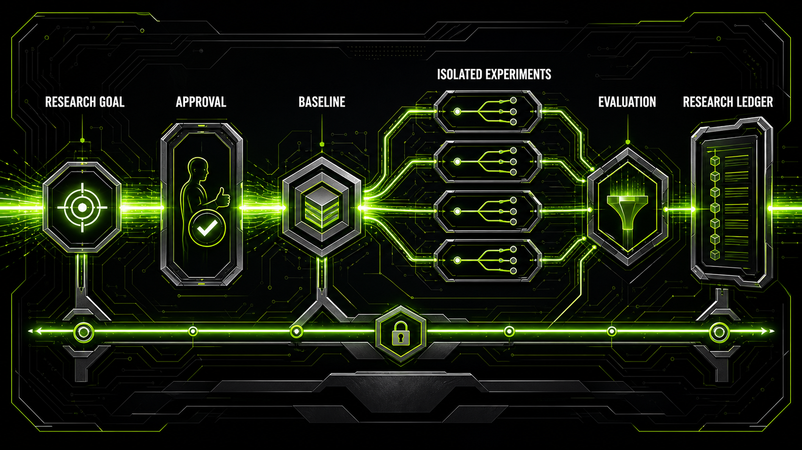

# Research Loop

> Turn an existing Git research project and a scientific goal into a bounded, approved, and auditable experiment campaign.


[](LICENSE)



Research Loop combines a **portable Agent Skill for Codex and Claude Code** with a **deterministic Python runner**. The skill understands the research intent, inspects the target repository, and proposes focused hypotheses. The runner enforces the parts that should not depend on agent judgment: approval integrity, Git isolation, command execution, metric extraction, result classification, and durable records.

You provide the goal. Research Loop derives project-specific execution, evaluation, and strategy contracts from repository evidence, shows the complete dry-run plan for approval, establishes a baseline, and uses the approved Selector to rank evidence-backed hypotheses before running each experiment in its own Git worktree. The DAG remains provenance; strategy and hypothesis interpretation are tracked separately.

> [!IMPORTANT]
> This project contains modified, unofficial derivatives of NVIDIA agent skills. It is not affiliated with, endorsed by, or verified by NVIDIA. See [Upstream and licensing](#upstream-and-licensing).

## Why Research Loop?

Autonomous experimentation becomes difficult to trust when the agent can silently change the command, evaluation conditions, or code under your working checkout. Research Loop makes those boundaries explicit.

| Common failure mode | Research Loop's approach |
| --- | --- |
| Every project needs custom agent glue | Generate one project-specific **Research Profile** from repository evidence |
| Approval is vague or open-ended | Bind approval to an exact plan hash, base commit, commands, metric, scope, and policy |
| Experiments modify the active checkout | Create a separate branch and external Git worktree for every attempt |
| A convenient metric is selected after the run | Parse only the authoritative metric defined in the approved contract |
| Evaluation conditions drift | Validate explicit compatibility fields such as dataset version or query count |
| Long campaigns become hard to resume | Maintain an append-only ledger, checkpoint, and handoff document |
| The loop runs indefinitely | Enforce experiment-count and wall-clock budgets |
| Greedy iteration gets stuck on one branch | Balance `exploit`, `explore`, and `confirm` traces with deterministic candidate ranking |
| A campaign target is confused with a useful local gain | Track baseline, parent, champion, target, and confirmation separately |
| One search policy is forced onto every project | Approve a project-specific Strategy Contract with diagnostic, balanced, or optimization selection |
| Scientific interpretation disappears into logs | Record predictions, falsification criteria, and agent-authored Hypothesis Evidence against verified artifacts |

The same Agent Skill is packaged for both Codex and Claude Code; both clients delegate deterministic and safety-critical state transitions to the shared Python runner.

Research Loop is useful when you have:

- an existing Git repository with a reproducible experiment command;
- an authoritative metric in JSON, JSONL, or text output;
- a focused goal that can be tested through small code or configuration changes; and
- a need to preserve every attempt for later inspection.

It is not intended for ordinary bug fixes, general code review, one-off commands, or projects that require GPU, remote, paid, Slurm, SSH, or Kubernetes execution in v0.3.

## How it works

1. **Inspect** the existing Git project for runnable commands, evaluators, metrics, and path constraints.
2. **Compile** the verified evidence and exact user goal into a project-specific Research Profile and Strategy Contract.
3. **Plan and approve** the commands, metric source, modification scope, Selector transitions, resource class, and campaign limits under one exact hash.
4. **Establish a baseline** as the authoritative comparison anchor.
5. **Register hypotheses and rank candidates** using verified evidence plus the active diagnostic, balanced, or optimization Selector.
6. **Prepare the recommended DAG node** on its own preserved branch and external Git worktree, leaving the base checkout untouched.
7. **Execute, evaluate, and record** smoke and full runs against baseline, parent, and champion; append Hypothesis Evidence, apply at most one approved strategy transition, and confirm an identical Git tree before declaring success.

The Agent Skill owns interpretation and hypothesis formation. The runner owns deterministic state transitions and safety checks. Changing the goal, command, policy, resource class, Research Profile, or base commit invalidates the approval and requires a new plan.

### Core concepts

| Concept | Meaning |
| --- | --- |
| **Research Goal** | The user's desired outcome, success criteria, constraints, and stop rules |
| **Research Profile** | A generated, project-specific representation of the goal and verified repository facts |
| **Execution Contract** | Approved argv commands, working directory, resource class, environment names, and time limits |
| **Evaluation Contract** | Authoritative metric parser, comparison direction, artifacts, compatibility checks, and confirmation policy |
| **Strategy Contract** | Project shape, agent rationale, initial Selector, and deterministic transition rules |
| **Selector** | Deterministic policy that recommends the next eligible candidate |
| **Hypothesis Evidence** | Agent-authored scientific assessment grounded in a recorded metric, log, or artifact |
| **Campaign** | One approved baseline plus a bounded sequence of related experiments |
| **Research Ledger** | Append-only TSV record connecting each attempt to its branch, commit, command, metric, and decision |
| **Candidate DAG** | Logical experiment ancestry across exploit, explore, confirm, debug, and recombine operators |

## Quick start

### 1. Install the development build

Requirements: [Git](https://git-scm.com/), [uv](https://docs.astral.sh/uv/), and Python 3.9 or newer.

```bash
git clone https://github.com/junjunjunbong/research-loop.git
cd research-loop
uv sync --extra dev
uv run research-loop --help
```

The Codex manifest is at [`.codex-plugin/plugin.json`](.codex-plugin/plugin.json). The Claude Code [plugin manifest](.claude-plugin/plugin.json) and [self-hosted marketplace](.claude-plugin/marketplace.json) are under `.claude-plugin/`. Both clients use the same Agent Skill entrypoint at [`skills/research-loop/SKILL.md`](skills/research-loop/SKILL.md) and the same Python runner.

#### Codex plugin install

The canonical Codex identity is `research-loop@research-loop`. Register the
repository as a Git marketplace at an immutable release tag or full commit SHA,
then install the plugin from that marketplace:

```bash
codex plugin marketplace add junjunjunbong/research-loop \
  --ref v0.4.0
codex plugin add research-loop@research-loop
```

`v0.4.0` is the immutable 0.4.0 release source. Future releases should use
their own immutable release tag or full commit SHA.

Do not register a mutable development checkout as the live marketplace source.
Codex installs a cached copy, but refreshing a local marketplace that follows a
branch-changing checkout can replace that cache with a different version.

To migrate a machine that previously used the legacy local marketplace, keep
the old installation until the canonical install above succeeds. Verify it,
then remove only the legacy identity and marketplace:

```bash
codex plugin list --marketplace research-loop
codex plugin remove research-loop@local-research-loop
codex plugin marketplace remove local-research-loop
codex plugin list
```

The repository-owned Codex marketplace manifest is
[`.agents/plugins/marketplace.json`](.agents/plugins/marketplace.json). Its
marketplace name and plugin name are both `research-loop`, matching Claude Code.

#### Claude Code plugin install

For local plugin development from this checkout:

```bash
claude plugin marketplace add ./ --scope project
claude plugin install research-loop@research-loop --scope project
```

After the Claude Code manifests are available on GitHub, install from the repository-hosted marketplace:

```bash
claude plugin marketplace add junjunjunbong/research-loop
claude plugin install research-loop@research-loop --scope project
```

The Claude Code skill is exposed as:

```text
/research-loop:research-loop
```

### 2. Start from Codex or Claude Code

Open an existing Git research project and ask either client for a bounded research campaign. In Claude Code, invoke `/research-loop:research-loop`; in Codex, request the workflow directly. For example:

```text
Set up and run a bounded autonomous research campaign for this repository.
Goal: improve retrieval recall@10 without changing the dataset or evaluator.
Allow at most 5 experiments and 2 hours of local CPU time.
```

The skill inspects the project before asking for missing facts, compiles the Research Profile, and presents the exact dry-run plan. No baseline or experiment should run until you explicitly approve that plan.

### 3. Inspect and approve manually

The runner can also be driven directly. Keep the plugin and target repository as separate paths:

```bash
export PLUGIN_ROOT=/path/to/research-loop
export TARGET_REPO=/path/to/your-project

uv run --project "$PLUGIN_ROOT" research-loop inspect \
  --repo "$TARGET_REPO"

uv run --project "$PLUGIN_ROOT" research-loop new-campaign \
  --repo "$TARGET_REPO" \
  --profile /tmp/research-profile.yaml \
  --base HEAD

uv run --project "$PLUGIN_ROOT" research-loop validate \
  --repo "$TARGET_REPO"

uv run --project "$PLUGIN_ROOT" research-loop plan \
  --repo "$TARGET_REPO"
```

Review the returned commands, metric source, allowed paths, protected paths, resource class, limits, and `plan_hash`. Only after approving that exact plan:

```bash
uv run --project "$PLUGIN_ROOT" research-loop approve \
  --repo "$TARGET_REPO" \
  --plan-hash <approved-plan-hash>
```

The Research Profile is agent-generated; users should not need to author it by hand. Its complete schema and annotated examples are in [`profile-schema.md`](skills/research-loop/references/profile-schema.md), [`examples/mock-profile.yaml`](examples/mock-profile.yaml) for legacy schema v0, [`examples/mock-profile-v1.yaml`](examples/mock-profile-v1.yaml) for the evidence-guided DAG workflow, and [`examples/mock-profile-v2.yaml`](examples/mock-profile-v2.yaml) for Strategy Contracts and Hypothesis Evidence.

## Run a campaign

Record an authoritative baseline first:

```bash
uv run --project "$PLUGIN_ROOT" research-loop prepare \
  --repo "$TARGET_REPO" \
  --id baseline \
  --baseline \
  --hypothesis "Record the unmodified authoritative baseline."

uv run --project "$PLUGIN_ROOT" research-loop execute --repo "$TARGET_REPO" --id baseline --mode smoke
uv run --project "$PLUGIN_ROOT" research-loop execute --repo "$TARGET_REPO" --id baseline --mode full
uv run --project "$PLUGIN_ROOT" research-loop evaluate --repo "$TARGET_REPO" --id baseline
uv run --project "$PLUGIN_ROOT" research-loop record --repo "$TARGET_REPO" --id baseline
```

Render evidence for the next operator, register a scored candidate, and ask the deterministic policy to rank the eligible DAG nodes:

```bash
uv run --project "$PLUGIN_ROOT" research-loop hypothesis-add \
  --repo "$TARGET_REPO" \
  --spec /tmp/hypothesis.yaml

uv run --project "$PLUGIN_ROOT" research-loop evidence \
  --repo "$TARGET_REPO" \
  --operator improve \
  --parent-id baseline

uv run --project "$PLUGIN_ROOT" research-loop candidate-add \
  --repo "$TARGET_REPO" \
  --spec /tmp/candidate.yaml

uv run --project "$PLUGIN_ROOT" research-loop candidate-rank \
  --repo "$TARGET_REPO"

uv run --project "$PLUGIN_ROOT" research-loop prepare \
  --repo "$TARGET_REPO" \
  --id increase-candidate-pool \
  --candidate-id <recommended-candidate-id>
```

`prepare` returns the isolated worktree path. Make only the approved change in that worktree and commit it. The runner rejects an experiment that is uncommitted, changes a protected path, or touches a path outside the approved scope.

```bash
uv run --project "$PLUGIN_ROOT" research-loop execute --repo "$TARGET_REPO" --id increase-candidate-pool --mode smoke
uv run --project "$PLUGIN_ROOT" research-loop execute --repo "$TARGET_REPO" --id increase-candidate-pool --mode full
uv run --project "$PLUGIN_ROOT" research-loop evaluate --repo "$TARGET_REPO" --id increase-candidate-pool
uv run --project "$PLUGIN_ROOT" research-loop record --repo "$TARGET_REPO" --id increase-candidate-pool
uv run --project "$PLUGIN_ROOT" research-loop hypothesis-evidence-add --repo "$TARGET_REPO" --spec /tmp/hypothesis-evidence.yaml
uv run --project "$PLUGIN_ROOT" research-loop status --repo "$TARGET_REPO"
```

Smoke runs validate plumbing only and can never become performance results. A confirmation uses a new candidate and experiment ID, the `confirm` operator, the current champion as its primary parent, and an identical Git tree. See the [full campaign workflow](skills/research-loop/references/workflow.md).

## Result states

Every evaluated full run receives one of six explicit states:

| State | Meaning |
| --- | --- |
| `promising` | A valid result improves on its parent, becomes a new champion, or reaches the target, but still needs identical-tree confirmation |
| `keep` | A valid baseline, or a qualifying code tree confirmed by the required number of compatible full runs |
| `discard` | The primary metric regressed from its parent beyond the configured noise tolerance |
| `inconclusive` | A valid result remains within the configured parent-improvement threshold |
| `crash` | The approved command timed out or exited unsuccessfully |
| `invalid` | Artifacts, metric parsing, compatibility, duration, or baseline requirements failed |

This distinction prevents execution failures, invalid comparisons, and genuine regressions from being collapsed into a single “failed” result. The exact rules are documented in [`decision-policy.md`](skills/research-loop/references/decision-policy.md).

## State, artifacts, and recovery

`new-campaign` creates a versioned control plane inside the target repository. A schema v2 campaign adds the Strategy Contract and hypothesis evidence state:

```text
.research/
├── index.json                         # campaign registry and active campaign
└── campaigns/<campaign>/
    ├── research-context.yaml          # goal, success criteria, and path scope
    ├── environment.yaml               # approved commands and execution limits
    ├── evaluation.yaml                # metric, target, and compatibility contract
    ├── research-strategy.yaml         # approved project shape, Selector, and transitions
    ├── loop-policy.yaml               # campaign identity, traces, and budgets
    ├── plan.json                      # rendered dry run and plan hash
    ├── approval.json                  # exact approved plan hash
    ├── candidates.json                # scored DAG candidate registry
    ├── candidates/                    # immutable per-candidate snapshots
    ├── hypotheses.json                # current lightweight hypothesis assessments
    ├── hypothesis-events.jsonl        # append-only Hypothesis Evidence
    ├── strategy-state.json            # active Selector and applied transitions
    ├── strategy-events.jsonl          # append-only strategy history
    ├── experiments.tsv                # append-only Research Ledger
    ├── hypotheses.md                  # hypothesis history
    ├── state.md                       # current checkpoint
    ├── handoff.md                     # durable resume instructions
    └── runs/<experiment>/
        ├── experiment.json
        ├── smoke/{manifest.json,run.log,evaluation.json}
        └── full/{manifest.json,run.log,evaluation.json}
```

`.research/` is added to the target repository's local `.git/info/exclude`, so campaign state does not modify the shared `.gitignore`. Experiment worktrees live outside the project under:

```text
~/.cache/research-loop/worktrees/<repo-hash>/<campaign>/<experiment>/
```

To resume, resolve the active campaign from `.research/index.json`, read its `handoff.md` and `state.md`, inspect the latest ledger row, then run:

```bash
uv run --project "$PLUGIN_ROOT" research-loop status --repo "$TARGET_REPO"
```

Always verify the base Git state before continuing. A changed base commit or contract makes prior approval stale by design.

### Upgrade legacy state and switch campaigns

Inspect a schema v0 control plane before applying its atomic migration:

```bash
uv run --project "$PLUGIN_ROOT" research-loop upgrade --repo "$TARGET_REPO" --check
uv run --project "$PLUGIN_ROOT" research-loop upgrade --repo "$TARGET_REPO" --apply
```

The migrated campaign remains readable but cannot use DAG candidates. Existing schema v1 campaigns remain executable; create a new schema v2 campaign for Strategy Contracts and Hypothesis Evidence. Use `campaign-list` to inspect all campaigns and `campaign-activate --id <campaign-id>` to select the default used when `--campaign` is omitted.

## Safety boundary

v0.3 deliberately keeps the execution surface small:

- requires an existing clean Git commit before planning or execution;
- never edits or switches the user's base checkout;
- creates one preserved branch and external worktree per attempt;
- never merges, stashes, resets, cleans, force-pushes, or deletes branches automatically;
- executes argv arrays with `shell=False`, a process-group timeout, and exact logs;
- permits only local `light` or `local_cpu` resource classes;
- stores required environment variable names, never secret values;
- confines experiment edits and metric paths to the approved project scope; and
- treats only the approved parser as authoritative.

For the complete contract, read [`safety.md`](skills/research-loop/references/safety.md).

## CLI reference

All commands emit structured JSON and return exit code `2` for a Research Loop validation error.

| Command | Purpose |
| --- | --- |
| `inspect` | Inspect repository evidence without changing the project |
| `new-campaign` | Create a schema v1 or v2 campaign from an explicit Git base |
| `setup` | Materialize a legacy schema v0 Research Profile |
| `upgrade` | Check or apply a v0-to-v1 control-plane migration |
| `campaign-list` | List local research campaigns |
| `campaign-activate` | Select the active versioned campaign |
| `validate` | Validate the profile and report campaign readiness |
| `plan` | Render and save the dry-run campaign plan |
| `approve` | Record approval for an exact plan hash |
| `evidence` | Render evidence scoped to an experiment operator and parent nodes |
| `candidate-add` | Register a scored DAG hypothesis candidate |
| `candidate-rank` | Rank eligible candidates with the deterministic policy |
| `hypothesis-add` | Register a schema v2 hypothesis with prediction and falsification criteria |
| `hypothesis-list` | List hypothesis assessments and evidence counts |
| `hypothesis-evidence-add` | Append agent-authored evidence grounded in a recorded experiment |
| `prepare` | Create an experiment branch and isolated worktree |
| `execute` | Run the approved smoke or full command |
| `evaluate` | Parse authoritative metrics and assign a result state |
| `record` | Append one evaluated full run to the Research Ledger |
| `checkpoint` | Refresh durable state and handoff instructions |
| `status` | Summarize baseline, progress, remaining budget, and stop state |

Run `uv run research-loop <command> --help` for command-specific arguments.

## Development

Run the complete test suite:

```bash
uv run --extra dev pytest
```

The integration tests copy [`examples/mock-project/`](examples/mock-project/) into a temporary Git repository and exercise legacy v0 migration, the schema v1 DAG flow, and the schema v2 strategy flow: campaign creation, planning, approval, baseline, hypotheses, evidence, Selector transitions, isolated experiments, metric parsing, confirmation, ledger, and handoff. They launch no real training, GPU, remote, or paid workload.

Further reading:

- [Quickstart](docs/quickstart.md)
- [Architecture](docs/architecture.md)
- [Roadmap](docs/roadmap.md)
- [Bootstrap existing projects ADR](docs/adr/0001-bootstrap-existing-projects.md)
- [Single skill + isolated runner ADR](docs/adr/0002-single-skill-isolated-runner.md)
- [Provenance, strategy, and evidence ADR](docs/adr/0003-separate-provenance-strategy-and-evidence.md)

## Current v0.3 limits

- local `light` and `local_cpu` execution only;
- no GPU, Slurm, SSH, Kubernetes, remote, or paid execution;
- no automatic Git initialization or dirty-worktree capture;
- no automatic winning-branch merge or cleanup;
- no arbitrary shell pipelines;
- no graphical UI, hosted service, or multi-user coordination;
- no Bayesian Optimization, Hyperband, MCTS, probabilistic belief updates, or parallel experiment execution; and
- no required domain packs—retrieval/RAG is an application case, not an architectural dependency.

See the [roadmap](docs/roadmap.md) for planned extensions.

## Upstream and licensing

Five NVIDIA source files are preserved verbatim under [`vendor/nvidia/`](vendor/nvidia/) at commit `1700ebd31ba862df5b6992403764c989f2bda66b`. Exact provenance and integrity data are recorded in [`UPSTREAM.md`](UPSTREAM.md), [`NOTICE.md`](NOTICE.md), and [`vendor/nvidia/SHA256SUMS`](vendor/nvidia/SHA256SUMS).

NVIDIA signature files are intentionally excluded, and this derived skill must not be represented as NVIDIA-verified. The upstream dual-license text is preserved in [`LICENSE`](LICENSE): source code is licensed under Apache License 2.0, while documentation and skills are licensed under Creative Commons Attribution 4.0 International. Consult [`NOTICE.md`](NOTICE.md) for details.
